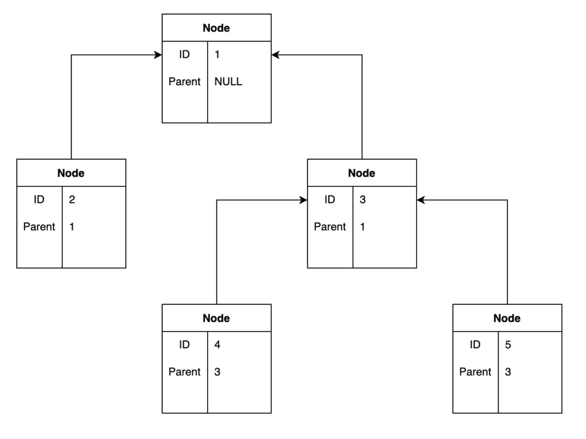

## miniapi development

Quick setup to git clone this repo: [README.md](README.md)

### WORKFLOW

Contributor must know how to work with git, and also git-flow, 
with GitFlow Simplified , contributor must create an extra development branch!

https://medium.com/goodtogoat/simplified-git-flow-5dc37ba76ea8

The developer, just fork with https://codeberg.org/repo/fork/204481 and 
clones the repository to creates the extra development branch, he starts 
working on it to later send git merge request to upstream.

### Prerequisites

* you must have your user as `/home/general`
* you must have `Devel` subpath for development as then `/home/general/Devel`
* you must not work as root! never! and we do not use `sudo` !
* all files must have LF as new line and good identation
* api is developed with PHP and CSS with only JS usage for dynamic things!
* our prefered IDE/editor is Geany! we support non big open source projects too!

### Framework

The base is made in GUACHI based framework https://gitlab.com/guachi/Guachi_Framework
but reduced as "miniapi" and only handles database and routing.

Any JS and/or CSS must be used directly without any network dependant 
tool neither remote based development tool, the development must be 
fully local and cannot depends of external things.

Our eyecandy framework is based on Bulma https://github.com/jgthms/bulma?tab=readme-ov-file

### routing structure and controllers

Any route must have a controller and also a module, both files must be named 
in same way and routing will have this name. 

There is no view cos its a concept, you can handle view using include routine 
inside model or controller.

The model is also a concept, but here is represented as class under controller, 
each controller has (and must has) a model, inside model all the bussiness logic 
will be code, but controller can handle also those pieces of code.


* INDEX for routing: `modules.ini`
* API calls `controllers/api/v1/<module>.php`
    * `models/api/v1/lists.php`
* LIST view `controllers/lists.php`
    * `models/lists.php`
* ASSETS files `public/assets/css/`
    * `bulma.css`
* VIEWS to include `public/views`
    * `index.php`

## example - an API documentation

This repository already has a default mini API, that handles two routes:
the `list` route to retrieve data from api and `store` route to save data with API.

You can change those settings and files on your needs, the default API example 
only handles a tree case, and retrieve the tree by nodes, there is no authentication.

#### Authentication

The is no authtentication by default in the example database, any authenticated 
route must be liste in private section of `modules.ini` filename of the root 
proyect sources outside of public directory.

You can just emulated the authenticated routes using a conditional in the controllers, 
that handle an API key that if are not listed will not accept the request or 
shows only minimal data.

In any case you must use the routing mechanish to manage authenticated routes, 
if you need more info please fils an issue at https://codeberg.org/codeigniter/miniapi/issues/new

#### api request format

* API CALL TO STORE `/api/v1/store?PAL=<string>&cidh=<string>&cidp=<string>` where:
    * PAL : a note in thirth column on database
    * cidh : value of node, could be father or son of other
    * cidp : value of parent node
* API CALL TO RETRIEVE `/api/v1/lists?cedp=<string>`
    * cidp : value of parent node to see all the childs node
    * if no string all the nodes will be retrieve!

#### api message format

```
    {
        "sucess": true,              // boolean : true | false if operation
        "message": "server message", // string(32) : a message from the server
        "page": 1,                   // integer : curent page of result, 0 on errors
        "pages": 1,                  // integer : max number of pages
        "per_page": 1,               // integer : how many results are per page
        "data": [                    // array : data of the results
            {
                "nodes_notes": String,  // any content of such node
                "nodes_childs": String, // the id of this node
                "nodes_parent": String, // if not -1 the parent node on tree
            }
        ]
    }
```

#### testing code

You can find test routines into the file [test.php](test.php).

### DATABASE

The database must be configured into `guachi.ini` config file, if you will 
use the Sqlite3 or Sqlite2 DBMS, you must use for best results full path to 
the files.

The `$db` object its already initialized into the model and controller, and 
you can access this by `$this->db` routine. Check the module example `list`.

By default the project it uses a default tree database, but if you does not have it 
it will try to initialize, only if the database file or sheme exists.

##### DAtabase API dictionary

This example alredy assumes this database layer structure: [miniapitree.sql](miniapitree.sql)



``` sql
DROP TABLE IF EXISTS datatree;

CREATE TABLE datatree (
 nodes_childs VARCHAR(40),
 nodes_parent VARCHAR(40) Default -1,
 nodes_notes VARCHAR(40),
PRIMARY KEY(nodes_childs),
FOREIGN KEY (nodes_parent) REFERENCES datatree(nodes_childs)
ON UPDATE CASCADE);
```

``` sql
INSERT INTO datatree (nodes_childs, nodes_parent, nodes_notes) VALUES ('1', -1, 'padre');
INSERT INTO datatree (nodes_childs, nodes_parent, nodes_notes) VALUES ('5', '3', 'otro hijo de hijo');
INSERT INTO datatree (nodes_childs, nodes_parent, nodes_notes) VALUES ('6', -1, 'padre');
INSERT INTO datatree (nodes_childs, nodes_parent, nodes_notes) VALUES ('2', '1', 'hijo');
INSERT INTO datatree (nodes_childs, nodes_parent, nodes_notes) VALUES ('3', '1', 'hijo bajo');
INSERT INTO datatree (nodes_childs, nodes_parent, nodes_notes) VALUES ('4', '3', 'hijo bajo');
INSERT INTO datatree (nodes_childs, nodes_parent, nodes_notes) VALUES ('7', '6', 'hijo deotro');
```

``` sql
SELECT e1.nodes_childs, e1.nodes_parent, e1.nodes_notes
FROM datatree e1
WHERE e1.nodes_parent = '-1'
UNION ALL
SELECT e2.nodes_childs, e2.nodes_parent, e2.nodes_notes
FROM datatree e2
JOIN datatree e3 ON e2.nodes_parent = e3.nodes_childs;
```


### WEBSERVER

Para que esto funcione debe tener un dns interno apuntando "miniapi.localhost" o sino a 127.0.0.1

* lighttpd: la configuracion puede ser insertada en una seccion server 
o en una seccion de directorio de usurio:

```
$HTTP["host"] =~ "miniapi\.minenux$" {
        server.document-root = "/home/general/Devel/miniapi/public/"
        accesslog.filename = "/var/log/lighttpd/miniapi.log"
        alias.url = ()
        url.redirect = ()
        url.rewrite-once = (
                "^/(css|img|js|fonts)/.*\.(jpg|jpeg|gif|png|swf|avi|mpg|mpeg|mp3|flv|ico|css|js|woff|ttf)$" => "$0",
                "^/(favicon\.ico|robots\.txt|sitemap\.xml)$" => "$0",
                "^/[^\?]*(\?.*)?$" => "index.php/$1"
        )
}
```

* apache2: esta es la mejor opcion, no por popular, sino por ser mas 
flexible en opciones para el novato, es la peor para produccion:

```
<VirtualHost *:80>
        ServerName miniapi.minenux
        DocumentRoot /home/general/Devel/miniapi/public

        <Directory "/home/general/Devel/miniapi/public">
                DirectoryIndex index.php
                Options FollowSymLinks Indexes
                AllowOverride All
                Order deny,allow
                allow from All
        </Directory>
</VirtualHost>
```

* nginx: la conffiguracion debe secuestrar un puerto entero, asi que 
no es la mejor opcion para servidor:

```
server {
    listen 80;
    server_name miniapi\.minenux;
    root /home/general/Devel/miniapi/public;
    index index.php;
    location / {
        try_files $uri $uri/ /index.php?$query_string;
    }
    location ~ \.php$ {
        try_files $uri =404;
        fastcgi_pass unix:/run/php/php-fpm.sock;
        fastcgi_index index.php;
        fastcgi_param SCRIPT_FILENAME $document_root$fastcgi_script_name;
        include fastcgi_params;
    }
}
```


## LICENSE

The Guachi Framework is open-source software under the MIT License, this downstream part is a reduced version for!
Este minicore conteine partes del framework Banshee bajo la misma licencia.

* (c) 2016 Dias Victor aka Master Vitronic
* (c) 2023 Dias Victor @diazvictor

El proyecto minenux-skindb-webdb es open source y free software bajo la licencia **CC-BY-SA-NC** Compartir igual sin derecho comercial a menos que se pida permiso esten de acuerdo ambas partes, y con atribuciones de credito.

* (c) 2023 PICCORO Lenz McKAY <mckaygerhard>
* (c) 2023 Dias Victor @diazvictor
* (c) 2023 Lucero Tyron
